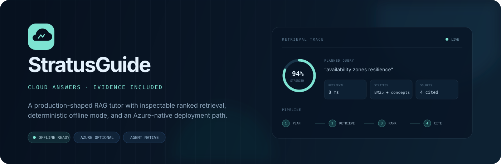
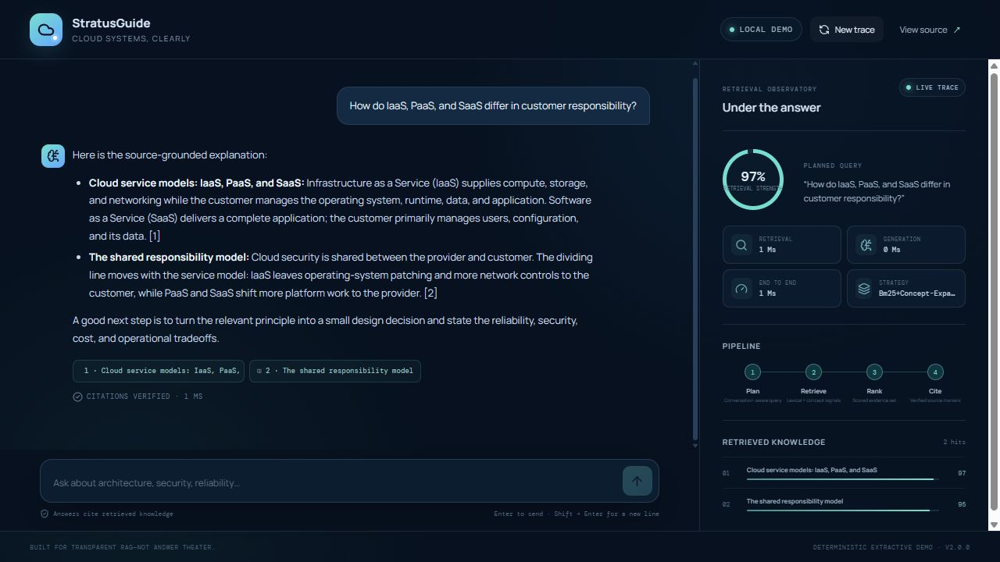
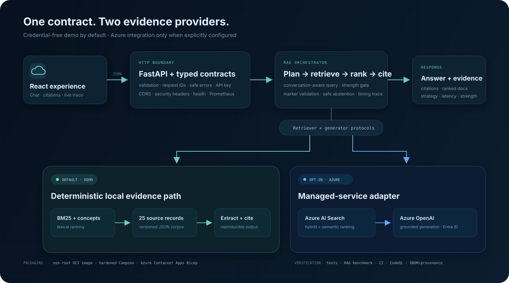

<p align="center">
  
</p>

<p align="center">
  <a href="https://github.com/Z-MarkUs/Cloud-Computing-Expertise-Enhancement-via-AI/actions/workflows/ci.yml"></a>
  <a href="https://github.com/Z-MarkUs/Cloud-Computing-Expertise-Enhancement-via-AI/actions/workflows/security.yml"></a>
  <a href="https://github.com/Z-MarkUs/Cloud-Computing-Expertise-Enhancement-via-AI/actions/workflows/container.yml"></a>
  
  
  <a href="LICENSE"></a>
</p>

<p align="center"><strong>A source-grounded cloud-computing tutor that shows its work.</strong></p>

<p align="center">
  Run a complete credential-free RAG path locally, inspect every retrieved passage and timing,
  or opt into the same typed contract backed by Azure AI Search and Azure OpenAI.
</p>

<p align="center">
  <a href="https://codespaces.new/Z-MarkUs/Cloud-Computing-Expertise-Enhancement-via-AI?quickstart=1">Open in Codespaces</a>
  · <a href="#run-it-locally">Run locally</a>
  · <a href="#quality-evidence">See the evidence</a>
  · <a href="infra/README.md">Azure deployment guide</a>
</p>

## The idea

Most RAG demos stop at a chat box. StratusGuide makes the retrieval path part of the product: each answer carries verified numeric citations while the evidence panel exposes the planned query, active strategy, ranked documents, retrieval strength, and latency split.

The default mode is deterministic and self-contained. It needs no API key, subscription, or network call after installation, so a reviewer can clone the repository and reproduce its behavior. Azure mode is an optional adapter—not a hidden requirement and not a deployment claim.



### What makes it worth opening

| Typical portfolio gap | StratusGuide's answer |
| --- | --- |
| The answer hides its context | Clickable excerpts, ranked documents, strategy, strength, and timings are visible beside the answer. |
| The demo needs paid cloud services | Demo mode runs from a versioned 25-document corpus with deterministic BM25 plus concept expansion. |
| “Grounded” is only a prompt instruction | The service parses source markers, removes uncited sources, and fails closed when attribution is missing or invalid. |
| RAG quality is anecdotal | A committed 60-case regression benchmark gates retrieval, citation integrity, irrelevant-source precision, and abstention. |
| Provider code leaks everywhere | Demo and Azure implementations sit behind the same typed retriever and generator protocols. |
| Operations are an afterthought | Health/readiness probes, Prometheus metrics, safe errors, a hardened container, CI, CodeQL, SBOM/provenance, and Bicep are part of the repository. |

## Run it locally

### One-command full stack

With Docker installed:

```bash
git clone https://github.com/Z-MarkUs/Cloud-Computing-Expertise-Enhancement-via-AI.git
cd Cloud-Computing-Expertise-Enhancement-via-AI
docker compose up --build
```

Open <http://localhost:8000>. The safe default is `CLOUD_TUTOR_MODE=demo`; no `.env` file or cloud credential is needed.

### Development loop

Prerequisites: Python 3.11+, [uv](https://docs.astral.sh/uv/), Node.js 22+, and pnpm 11.

```bash
uv sync --locked --all-extras --dev
pnpm --dir frontend install --frozen-lockfile
```

Run the API and Vite client in separate terminals:

```bash
uv run cloud-tutor
```

```bash
pnpm --dir frontend dev
```

Then open <http://localhost:5173>. The Vite server proxies `/api`, `/health`, and `/metrics` to FastAPI on port 8000.

## Architecture



Both modes preserve `POST /api/chat` and its answer/citation/trace response. What changes is the implementation behind the provider boundary.

| | Demo mode — default | Azure mode — opt in |
| --- | --- | --- |
| Retriever | Deterministic BM25 plus curated concept expansion | Azure AI Search hybrid vector/text query with optional semantic ranking |
| Answer path | Extractive, reproducible, citation-marked response | Grounded Azure OpenAI generation with marker validation |
| Identity | None | API key fallback or `DefaultAzureCredential`/managed identity |
| Data | 25 vendor-neutral records committed in `data/` | An existing Azure AI Search index matching the configured fields |
| Best use | Local review, tests, regression evaluation | Integration with pre-existing Azure OpenAI and Search resources |
| Current evidence | Live local smoke and browser tested | SDK boundary fully mocked; no live Azure call is claimed |

The Bicep template deploys the application runtime, user-assigned identity, Container Apps environment, and capped Log Analytics workspace. It deliberately does **not** create models, Search indexes, source ingestion, or service role assignments. Those boundaries and the least-privilege setup are documented in [`infra/README.md`](infra/README.md).

## API contract

```bash
curl -s http://localhost:8000/api/chat \
  -H "Content-Type: application/json" \
  -H "X-Request-ID: readme-example-1" \
  -d '{"message":"How do RPO and RTO differ?","top_k":3}'
```

The stable response shape is:

```json
{
  "answer": "... [1]",
  "citations": [
    {
      "id": "1",
      "title": "RPO, RTO, backup, and disaster recovery",
      "section": "Business continuity",
      "excerpt": "...",
      "score": 0.887941,
      "uri": "https://..."
    }
  ],
  "trace": {
    "request_id": "readme-example-1",
    "mode": "demo",
    "query": "How do RPO and RTO differ?",
    "confidence": 0.693,
    "retrieval_strategy": "bm25+concept-expansion",
    "retrieval_ms": 1.239,
    "generation_ms": 0.243,
    "total_ms": 1.662,
    "retrieved_documents": [
      {
        "id": "rpo-rto-backup",
        "title": "RPO, RTO, backup, and disaster recovery",
        "score": 0.887941,
        "keyword_score": 0.887941,
        "vector_score": null
      }
    ]
  }
}
```

The serialized `confidence` field is a retrieval-strength heuristic, not a calibrated probability. The UI labels it accordingly.

Operational endpoints:

- `GET /api/config` — non-secret capabilities and active mode
- `GET /healthz` and `GET /health/live` — process liveness
- `GET /health/ready` — mode-aware readiness (loaded demo providers; Azure configuration, with an opt-in Search probe)
- `GET /metrics` — Prometheus exposition
- `GET /docs` — OpenAPI UI outside production mode

Optional `CLOUD_TUTOR_API_KEY` protects the chat endpoint without hiding liveness probes. The bundled browser client intentionally does not embed or transmit that shared secret; use the switch for API clients, or place an interactive deployment behind identity-aware ingress such as Container Apps authentication. Validation, authentication, provider, and unexpected failures use stable sanitized error envelopes with request IDs.

## Quality evidence

The following results were reproduced locally on Python 3.12 in demo mode. CI repeats the gates on Python 3.11 and 3.12 and uploads the coverage report, benchmark JSON, source distribution, and wheel.

| Gate | Current result | Command |
| --- | ---: | --- |
| Backend tests | 67 passed | `uv run pytest` |
| Backend branch-aware coverage | 92.86% | `uv run pytest --cov=cloud_tutor` |
| Python lint, format, types | Passed | `uv run ruff check .`; `uv run ruff format --check .`; `uv run mypy src` |
| Frontend component flows | 3 passed | `pnpm --dir frontend test` |
| Frontend coverage | 83.05% statements / 65.42% branches / 89.79% lines | `pnpm --dir frontend coverage` |
| Package build | sdist + wheel passed | `uv build --no-sources` |
| Skill portability | Passed | `uv run python .agents/skills/cloud-rag-engineer/scripts/check_portability.py` |

### Deterministic RAG regression benchmark

The committed suite contains 50 answerable and 10 abstention cases across all 25 corpus records. It includes direct questions, paraphrases, ambiguous wording, near-domain prompts, multi-turn context, and prompt-injection-shaped inputs.

| Metric | Result | Gate |
| --- | ---: | ---: |
| Retrieval hit rate | 1.00 | ≥ 0.90 |
| Mean reciprocal rank | 0.99 | ≥ 0.75 |
| Source precision | 1.00 | ≥ 0.95 |
| Noise-free citation rate | 1.00 | ≥ 0.90 |
| Citation marker validity | 1.00 | 1.00 |
| Expected-source citation coverage | 1.00 | ≥ 0.95 |
| Required-term coverage | 1.00 | ≥ 0.90 |
| Abstention accuracy | 1.00 | 1.00 |

Run it with:

```bash
uv run python -m evals.run_evaluation --json-output work/eval-results.json
```

This is a **same-corpus deterministic regression suite**, not a held-out academic evaluation, an LLM-judge score, a service-level latency benchmark, or evidence of live Azure quality. Its job is to stop known retrieval, attribution, irrelevant-tail, and abstention regressions from shipping.

## Engineering and delivery

- **API boundary:** strict Pydantic models, bounded inputs, conversation alternation checks, request correlation, optional constant-time API-key comparison, CORS allow-list, and production security headers.
- **Grounding boundary:** retrieved text is treated as untrusted data; source markers must be present and in range; malformed attribution returns a safe abstention with no citations.
- **Observability:** retrieval/generation/total timings, ranked-document traces, request and chat counters, latency histograms, retrieval-strength histograms, and mode-aware readiness checks.
- **Container:** multi-stage pnpm/uv build, non-root UID, read-only Compose filesystem, dropped Linux capabilities, no-new-privileges, resource limits, and health checks.
- **Supply chain:** exact uv and pnpm locks, Dependabot, pre-commit, CodeQL, dependency review, multi-architecture GHCR publishing, BuildKit SBOM, provenance, and artifact attestations.
- **Infrastructure:** parameterized Azure Container Apps Bicep with HTTPS-only ingress, optional CIDR restrictions, user-assigned identity, encrypted environment traffic, probes, autoscaling, Log Analytics retention, and an ingestion cap.

Static Bicep, workflow, Dockerfile, Compose, JSON, and YAML validation are included. GitHub secret scanning and push protection are enabled on the public repository. Docker was not available on the development machine, so the Linux image runtime is verified by a GitHub Actions smoke test rather than claimed as a local container run. No Azure resource has been deployed by this repository.

## Azure adapter

Copy `.env.example`, switch `CLOUD_TUTOR_MODE=azure`, and configure the five required non-secret values:

```dotenv
CLOUD_TUTOR_AZURE_OPENAI_ENDPOINT=https://<account>.openai.azure.com/
CLOUD_TUTOR_AZURE_CHAT_DEPLOYMENT=<chat-deployment>
CLOUD_TUTOR_AZURE_EMBEDDING_DEPLOYMENT=<embedding-deployment>
CLOUD_TUTOR_AZURE_SEARCH_ENDPOINT=https://<service>.search.windows.net
CLOUD_TUTOR_AZURE_SEARCH_INDEX=<index-name>
```

Use `az login` locally or managed identity in Azure. Key-based authentication is supported only as a fallback and belongs in ignored environment variables or Key Vault references—not source control. See the [deployment and RBAC guide](infra/README.md) for `what-if`, deployment, role assignments, and networking limitations.

## Agent-native repository guidance

The project ships the same `cloud-rag-engineer` skill for both coding-agent discovery conventions:

- Codex: [`.agents/skills/cloud-rag-engineer/`](.agents/skills/cloud-rag-engineer/)
- Claude Code: [`.claude/skills/cloud-rag-engineer/`](.claude/skills/cloud-rag-engineer/)
- Canonical repository guidance: [`AGENTS.md`](AGENTS.md)
- Claude import shim: [`CLAUDE.md`](CLAUDE.md)

The shared skill uses portable Agent Skills frontmatter. Host-specific OpenAI UI metadata stays isolated under `agents/openai.yaml`, while CI fails if the two discovery copies drift. The layout follows the documented [Codex skill](https://learn.chatgpt.com/docs/build-skills) and [Claude Code skill](https://code.claude.com/docs/en/skills) locations.

## Repository map

```text
src/cloud_tutor/    FastAPI boundary, orchestration, metrics, providers
data/               Versioned demo knowledge corpus
evals/              60-case deterministic regression harness
tests/              Unit, API, Azure-mock, security, and grounding tests
frontend/           React 19 + TypeScript evidence-first interface
infra/              Azure Container Apps Bicep and deployment guide
.agents/skills/     Codex project skill
.claude/skills/     Claude Code project skill
.github/workflows/  CI, security scanning, and OCI publication
```

## Honest limitations and next steps

- The local corpus is intentionally small and vendor-neutral; it is a teaching/demo set, not an enterprise document-ingestion system.
- Azure OpenAI and Azure AI Search code is fully mocked in tests but has not been exercised against a live subscription in this repository.
- The Bicep template deploys the app shell, identity, monitoring, and scaling policy; Azure model deployment, index schema/ingestion, external-service RBAC, and private networking remain environment-specific work.
- Prometheus metrics are process-local. A multi-replica production deployment needs an external collector and authenticated metrics access.
- The next evaluation step is a separately curated held-out set plus an authorized live-Azure smoke suite; neither result is implied by the current perfect regression scores.

## Attribution and license

The March 2025 prototype adapted parts of Microsoft's `Azure-Samples/azure-search-openai-demo`. Version 2 replaces that copied legacy implementation with the architecture, corpus, evaluation, interface, provider boundary, and delivery system described above; the original commits remain visible in Git history. See [`THIRD_PARTY_NOTICES.md`](THIRD_PARTY_NOTICES.md) for the upstream notice and [`LICENSE`](LICENSE) for this project's MIT license.

Contributions are welcome—start with [`CONTRIBUTING.md`](CONTRIBUTING.md) and keep every public claim tied to reproducible evidence.
